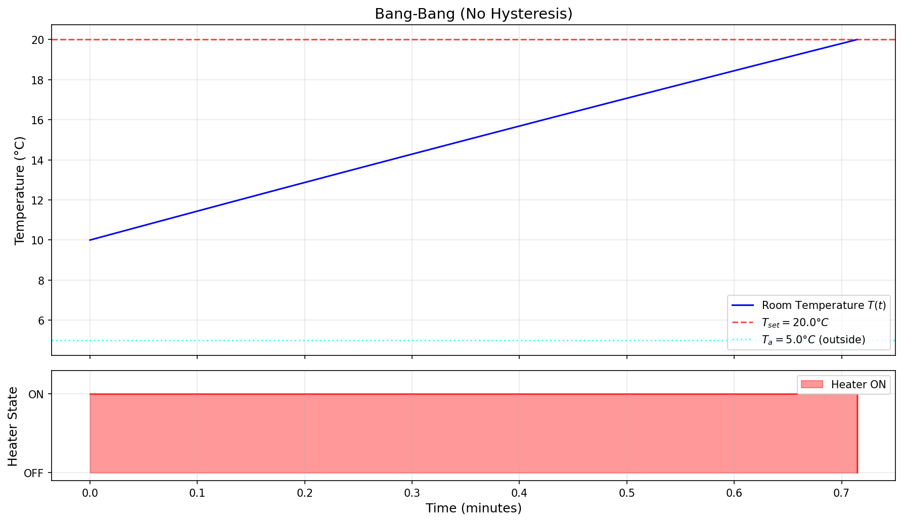
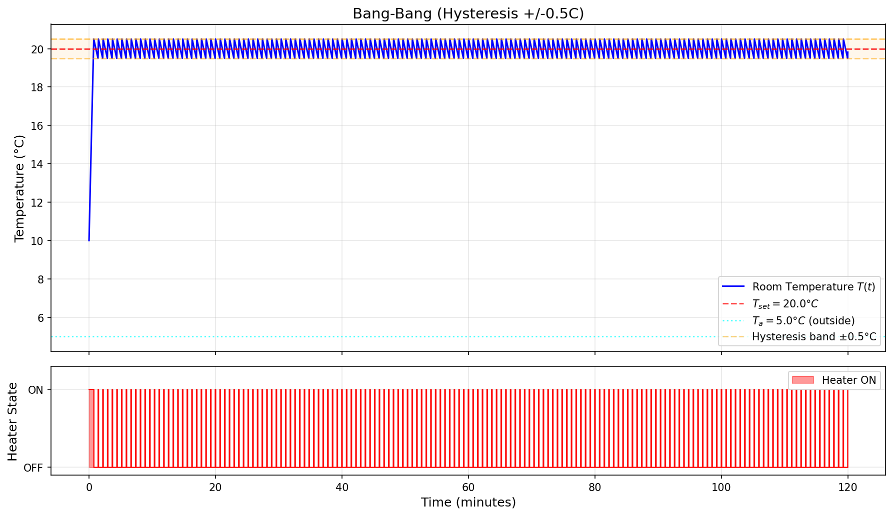
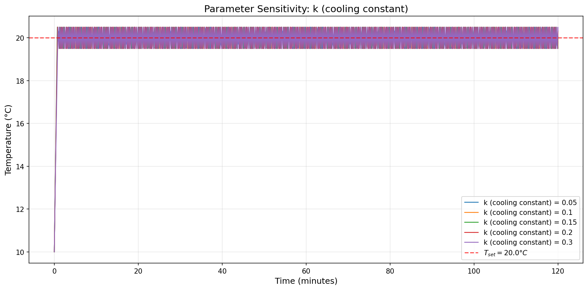
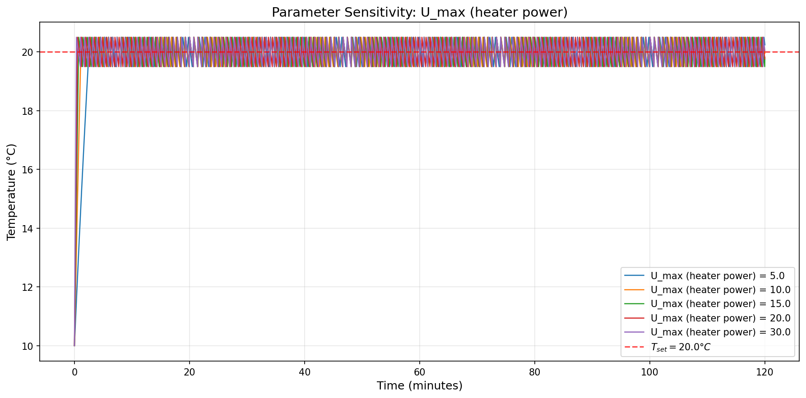
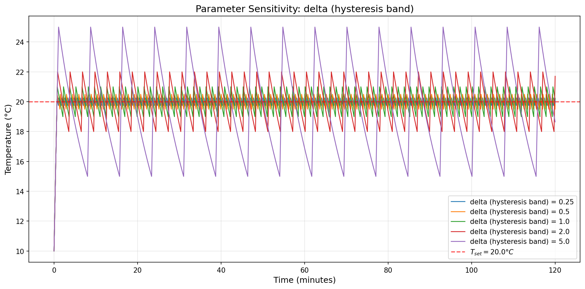

# Phase 1: ODE Model — Newton's Law of Cooling with Thermostat Control

## Overview

This phase implements a **zero-dimensional (spatially uniform)** model of a heated room. We assume the room temperature $T(t)$ is the same everywhere (well-mixed air), and only varies with time. A thermostat reads the room temperature and switches the heater ON/OFF accordingly.

---

## The Model

### Governing Equation

$$\frac{dT}{dt} = -k(T - T_a) + u(T)$$

| Symbol    | Meaning                           | Default Value  |
| --------- | --------------------------------- | -------------- |
| $T(t)$    | Room temperature (°C)             | Initial: 10°C  |
| $T_a$     | Outside temperature (°C)          | 5°C            |
| $k$       | Cooling constant (1/min) — 越大隔热越差 | 0.1            |
| $u(T)$    | Heater input (°C/min) — 由恒温器控制    | 0 or $U_{max}$ |
| $U_{max}$ | Maximum heater power              | 15             |
| $T_{set}$ | Thermostat set-point (°C)         | 20°C           |

**物理解释：**
- $-k(T - T_a)$：房间向外散热，温差越大散热越快（牛顿冷却定律）
- $u(T)$：加热器输入，由恒温器控制开关

### Control Strategies

**策略 1 — Bang-Bang（无滞回）：**
```
u = U_max    if T < T_set     (温度低于设定值 → 开)
u = 0        if T >= T_set    (温度达到设定值 → 关)
```
问题：在 $T = T_{set}$ 处会无限快速切换（Zeno 效应）。

**策略 2 — Bang-Bang + Hysteresis（带滞回带 ±δ）：**
```
Heater 开启   当 T 降到 T_set - δ 以下
Heater 关闭   当 T 升到 T_set + δ 以上
中间区域       保持当前状态不变
```
滞回带消除了 Zeno 效应，保证了最小开关间隔。

### 解析结果

**稳态温度（加热器常开）：**
$$T_{ss} = T_a + \frac{U_{max}}{k} = 5 + \frac{15}{0.1} = 155°C$$

这说明加热器足够强大，实际温度会被恒温器控制在 20°C 附近。

**振荡周期（带滞回）：**

加热阶段时间（从 $T_{low}$ 升到 $T_{high}$）：
$$t_{heat} = \frac{1}{k} \ln\left(\frac{T_{ss} - T_{low}}{T_{ss} - T_{high}}\right)$$

冷却阶段时间（从 $T_{high}$ 降到 $T_{low}$）：
$$t_{cool} = \frac{1}{k} \ln\left(\frac{T_{high} - T_a}{T_{low} - T_a}\right)$$

总周期 $P = t_{heat} + t_{cool}$。默认参数下 $P \approx 0.74$ 分钟。

---

## File Structure

```
phase1_ode/
├── ode_model.py                # 主代码：ODE solver + 实验 + 绘图
├── mathematical_derivation.md  # 完整数学推导（LaTeX 格式）
├── README.md                   # 本文件：代码和结果解释
├── exp1_bang_bang.png           # 实验 1 结果图
├── exp2_hysteresis.png         # 实验 2 结果图
├── exp3_sensitivity_k.png      # 实验 3 结果图
├── exp4_sensitivity_umax.png   # 实验 4 结果图
└── exp5_sensitivity_delta.png  # 实验 5 结果图
```

---

## Code Structure (`ode_model.py`)

代码分为 5 个模块：

### 1. `solve_bang_bang()` — 无滞回 Bang-Bang 求解器
- 使用 `scipy.integrate.solve_ivp` 分段求解 ODE
- 每次 $T$ 穿过 $T_{set}$ 时用 **event detection** 精确定位切换时刻
- 切换后改变 ODE 右端函数（加上或去掉 $U_{max}$），继续积分
- `max_switches=500` 防止 Zeno 效应导致无限循环

### 2. `solve_bang_bang_hysteresis()` — 带滞回 Bang-Bang 求解器
- 与上面相同，但切换阈值不同：
  - ON → OFF 在 $T_{high} = T_{set} + \delta$
  - OFF → ON 在 $T_{low} = T_{set} - \delta$
- 滞回带保证每次 ON/OFF 都有最小持续时间

### 3. `steady_state_temperature()` — 稳态分析
- 计算 $T_{ss} = T_a + U_{max}/k$

### 4. `oscillation_period_estimate()` — 振荡周期解析公式
- 用推导出的公式计算理论周期，可与数值结果对比验证

### 5. `plot_results()` / `plot_parameter_sensitivity()` — 可视化
- 双子图：上方温度曲线 + 下方 heater 状态
- 参数敏感性：多条曲线叠加对比

---

## Experiments and Results

### Experiment 1: Bang-Bang 无滞回



**观察：**
- 温度从 10°C 升至 20°C（约 0.7 分钟）
- 到达 $T_{set}$ 后，发生 499 次切换，全部集中在极短时间内
- **这就是 Zeno 效应** — 数学上温度「粘」在 $T_{set}$ 上，加热器无限快速开关
- 实际中不可能发生（机械继电器有最小响应时间），说明需要引入滞回

**结论：** 纯 Bang-Bang 控制在数学上存在 Zeno 病态，不适合直接使用。

---

### Experiment 2: Bang-Bang + Hysteresis (±0.5°C)



**观察：**
- 温度从 10°C 快速升至 ~20.5°C（首次超调）
- 随后在 [19.5°C, 20.5°C] 之间稳定振荡
- 振荡周期 ≈ 0.74 分钟（与解析公式一致）
- 322 次切换均匀分布在 120 分钟内
- Heater 状态图显示规则的 ON/OFF 方波

**结论：** 滞回带消除了 Zeno 效应，产生稳定的极限环振荡。温度波动 ±0.5°C 在舒适性上可接受。

---

### Experiment 3: 冷却常数 $k$ 的敏感性



| $k$ (1/min) | 含义 | 切换次数 | 周期 (min) |
|-------------|------|----------|-----------|
| 0.05 | 好隔热 | 170 | 1.40 |
| 0.10 | 中等 | 322 | 0.74 |
| 0.15 | 较差 | 456 | 0.52 |
| 0.20 | 差 | 572 | 0.42 |
| 0.30 | 很差 | 751 | 0.32 |

**结论：**
- $k$ 越大（隔热越差）→ 散热越快 → 冷却阶段更短 → 周期更短 → 切换更频繁
- 隔热差的房间，加热器工作更辛苦、能耗更高
- 这解释了为什么保温材料对节能如此重要

---

### Experiment 4: 加热器功率 $U_{max}$ 的敏感性



| $U_{max}$ | $T_{ss}$ (°C) | 切换次数 |
|-----------|---------------|----------|
| 5.0 | 55 | 247 |
| 10.0 | 105 | 303 |
| 15.0 | 155 | 322 |
| 20.0 | 205 | 331 |
| 30.0 | 305 | 341 |

**结论：**
- $U_{max}$ 主要影响加热速度，对切换频率影响相对较小
- 更强的加热器 → 更快到达设定温度（加热阶段更短）
- 但冷却阶段由 $k$ 和 $T_a$ 决定，与加热器功率无关
- 所以增大 $U_{max}$ 的边际收益递减

---

### Experiment 5: 滞回带宽度 $\delta$ 的敏感性



| $\delta$ (°C) | 切换次数 | 周期 (min) | 温度波动范围 |
|---------------|----------|-----------|-------------|
| 0.25 | 644 | 0.37 | ±0.25°C |
| 0.50 | 322 | 0.74 | ±0.5°C |
| 1.00 | 161 | 1.48 | ±1°C |
| 2.00 | 80 | 2.98 | ±2°C |
| 5.00 | 31 | 7.67 | ±5°C |

**结论 — 这是本阶段最重要的发现：**
- **$\delta$ 越大 → 周期越长 → 切换越少 → 但温度波动越大**
- 这是 **舒适度 vs 设备寿命** 的核心 trade-off
  - 小 $\delta$（如 0.25°C）：温度稳定但加热器频繁开关，磨损大
  - 大 $\delta$（如 5°C）：温度波动 ±5°C（15°C ↔ 25°C），不舒适
  - 实际恒温器通常选 $\delta \approx 0.5 - 1.0°C$ 作为折中
- 周期与 $\delta$ 近似线性关系：$\delta$ 加倍 → 周期约加倍

---

## How to Run

```bash
cd Code/phase1_ode
python ode_model.py
```

这会运行所有 5 个实验并在当前目录生成 5 张 PNG 图片。

**修改参数：** 编辑 `utils/parameters.py` 中的值即可。

**单独运行某个实验：**
```python
from ode_model import solve_bang_bang_hysteresis, plot_results
t, T, h = solve_bang_bang_hysteresis(k=0.2, delta=1.0)
plot_results(t, T, h, title="My Experiment", delta=1.0, save_path="my_exp.png")
```

---

## Next Steps (Week 2)

当前模型假设温度空间均匀 — 这在小房间、风扇搅拌的情况下是合理的，但实际上：
- 靠近加热器的地方更热
- 靠近窗户/外墙的地方更冷
- **恒温器放在不同位置，读数不同，控制效果不同**

Week 2 将引入 **空间维度**，使用 1D 热方程：
$$\frac{\partial T}{\partial t} = \alpha \frac{\partial^2 T}{\partial x^2} + u(x, t)$$

这允许我们研究恒温器放置位置对控制效果的影响 — 这是项目的核心问题。
